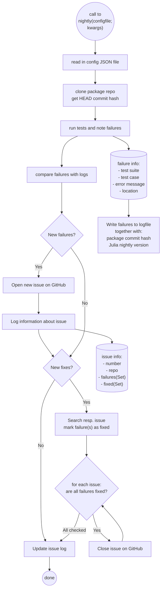

# Nightly workflow

## Idea
If you set up a CI job for the nightly version, which mirrors the typical Julia CI setup,
you may receive daily notifications about the same failing test in nightly.
If this is due to a problem with a package outside your control, it can lead you to ignore the notifications altogether.

To mitigate this, DownstreamTester opens an issue if *new* failures happen and closes the issue once
all failures of that day are resolved again.

## Example showcase
The nightly workflow is already set up in [VoronoiFVM.jl](https://github.com/WIAS-PDELib/VoronoiFVM.jl) and flagged an [issue](https://github.com/WIAS-PDELib/VoronoiFVM.jl/issues/175) about
the packages in the test environment not resolving.

Since the problem was fixed, a comment was added
to specify which failure is gone.

Since all failures of that issue were fixed
the issue was also closed automatically.

!!! todo
    add Screenshots

## Flowchart

